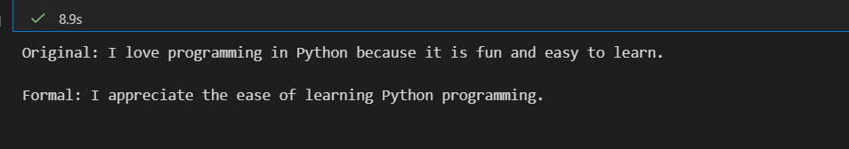

# StyleShift: Professional Text Formalization System

## Overview

StyleShift is a sophisticated text formalization system designed to convert informal or casual English into professional, formally-written English while preserving semantic meaning. The system utilizes a fine-tuned Language Model adapter built with QLoRA (Quantized Low-Rank Adaptation) technology for efficient inference without compromising quality.

## Key Features

- **Efficient Fine-tuning**: Implements QLoRA adapters for parameter-efficient model adaptation with minimal computational overhead
- **Lightweight Architecture**: Built on TinyLlama-1.1B-Chat, a compact yet capable language model suitable for professional deployment
- **Optimized Inference**: Utilizes 4-bit quantization to enable fast inference while maintaining model performance and reducing memory requirements
- **Semantic Preservation**: Maintains the original meaning and intent of the input text while elevating the linguistic formality and professionalism

## Example Output



## Installation

To set up the environment and install dependencies:

```bash
pip install -r requirements.txt
```

Ensure that CUDA-compatible GPU hardware is available for optimal performance.

## Usage

### Inference

Execute the inference demonstration notebook to evaluate the text formalization capabilities:

```bash
jupyter notebook infer.ipynb
```

This notebook provides examples of text conversion from casual to formal English with detailed analysis.

### Training and Fine-tuning

To conduct custom training or adapt the model to specific use cases, execute the training notebook:

```bash
jupyter notebook train.ipynb
```

## Model Architecture

- **Base Model**: TinyLlama/TinyLlama-1.1B-Chat-v1.0 (Pre-trained foundation model)
- **Adapter Configuration**: LoRA (Low-Rank Adaptation) adapters stored in the `adapters/` directory
- **Quantization**: 4-bit NF4 quantization with double quantization enabled
- **Training Framework**: Supervised Fine-Tuning (SFT) with QLoRA integration

## Workflow

### 1. Data Preparation
The system operates on structured instruction-based datasets containing pairs of informal and formal text examples. The dataset is formatted with explicit instruction, input, and response sections to guide the model during training.

### 2. Model Loading and Quantization
The base TinyLlama model is loaded with 4-bit quantization configuration to reduce memory footprint and accelerate inference. CUDA acceleration is enabled for GPU-based computation.

### 3. LoRA Adapter Training
During the training phase, lightweight LoRA adapters are attached to the model's query and value projection layers. These adapters capture the specific patterns for text formalization through supervised fine-tuning on the training dataset.

### 4. Inference Process
- Accept informal text input
- Construct a formatted prompt with instruction markers
- Generate formal text using the combined base model and LoRA adapter
- Extract and clean the generated output
- Return the formalized text to the user

### 5. Output Processing
Generated text is post-processed to remove any formatting artifacts, ensuring clean and professional output suitable for immediate use.

## Conclusion

StyleShift represents an effective and efficient approach to automated text formalization. By leveraging QLoRA fine-tuning on a lightweight base model, the system achieves professional-grade text conversion capabilities while maintaining computational efficiency. The system is suitable for various applications including academic writing assistance, business communication enhancement, and professional document preparation.

The architecture demonstrates that specialized language tasks can be accomplished effectively with carefully chosen base models and targeted adapter training, making StyleShift a practical solution for organizations seeking to elevate the professionalism of their written communications.
